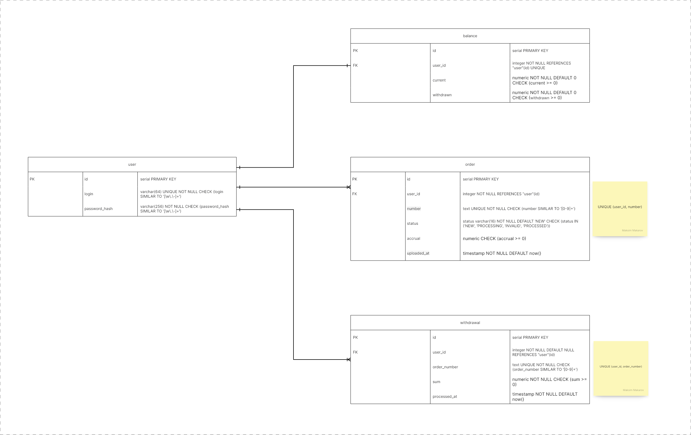

[](https://codecov.io/github/MisterMaks/go-yandex-gophermart)

# go-musthave-diploma-tpl

Шаблон репозитория для индивидуального дипломного проекта курса «Go-разработчик»

# Начало работы

1. Склонируйте репозиторий в любую подходящую директорию на вашем компьютере.
2. В корне репозитория выполните команду `go mod init <name>` (где `<name>` — адрес вашего репозитория на GitHub без
   префикса `https://`) для создания модуля

# Обновление шаблона

Чтобы иметь возможность получать обновления автотестов и других частей шаблона, выполните команду:

```
git remote add -m master template https://github.com/yandex-praktikum/go-musthave-diploma-tpl.git
```

Для обновления кода автотестов выполните команду:

```
git fetch template && git checkout template/master .github
```

Затем добавьте полученные изменения в свой репозиторий.

# Описание

- Запустить проект локально (сбилдить и запустить сервис): `make all`. Необходимо добавить env `DATABASE_URI` или флаг `-d` - это DSN, для подключения к БД PostgreSQL, на которой применятся миграции
- Запустить проект в docker: `make dcb`
- Запустить unit-тесты: `make unit_test`
- Запустить все тесты, вместе с интеграционными для PostgreSQL: `make test`. Необходимо добавить env `TEST_DATABASE_URI` - это DSN, переменная окружения для подключения к тестовой БД PostgreSQL, на которой пройдут интеграционные тесты. 

# Переменные окружения и флаги
| env                                  | flag      | type       | description                                           | required | default          |
|--------------------------------------|-----------|------------|-------------------------------------------------------|----------|------------------|
| `RUN_ADDRESS`                        | `-a`      | `string`   | Run address                                           | -        | "localhost:8080" |
| `DATABASE_URI`                       | `-d`      | `string`   | Database URI (DSN)                                    | +        | -                |
| `ACCRUAL_SYSTEM_ADDRESS`             | `-r`      | `string`   | Accrual system address                                | -        | ""               |
| `LOG_LEVEL`                          | `-l`      | `string`   | Log level                                             | -        | "INFO"           |
| `MIN_LOGIN_LEN`                      | `-mll`    | `uint`     | Minimum login length                                  | -        | 1                |
| `PASSWORD_KEY`                       | `-pk`     | `string`   | Password key                                          | -        | "supersecretkey" |
| `MIN_PASSWORD_LEN`                   | `-mpl`    | `uint`     | Minimum password length                               | -        | 1                |
| `TOKEN_KEY`                          | `-tk`     | `string`   | Token key                                             | -        | "supersecretkey" |
| `TOKEN_EXPIRATION`                   | `-te`     | `duration` | Token expiration                                      | -        | 15m              |
| `COUNT_WORKERS`                      | `-cw`     | `uint`     | Count workers                                         | -        | 1                |
| `PROCESS_ORDER_CHAN_SIZE`            | `-pocs`   | `uint`     | Process order chan size                               | -        | 256              |
| `PROCESS_ORDER_WAITING_TIME`         | `-powt`   | `duration` | Process order waiting time                            | -        | 1ns              |
| `UPDATE_EXISTED_ORDERS_WAITING_TIME` | `-uenowt` | `duration` | Update existed new orders waiting time                | -        | 2m               |
| `ACCRUAL_SYSTEM_REQUEST_TIMEOUT`     | `-asrt`   | `duration` | Accrual system request timeout                        | -        | 2s               |
| `TEST_DATABASE_URI`                  | -         | `string`   | Test database URI (DSN). Needed for integration tests | -        | ""               |

# Архитектура

### C1 System context diagram


### C2 Container diagram


### C3 Component diagram


### DB Scheme

